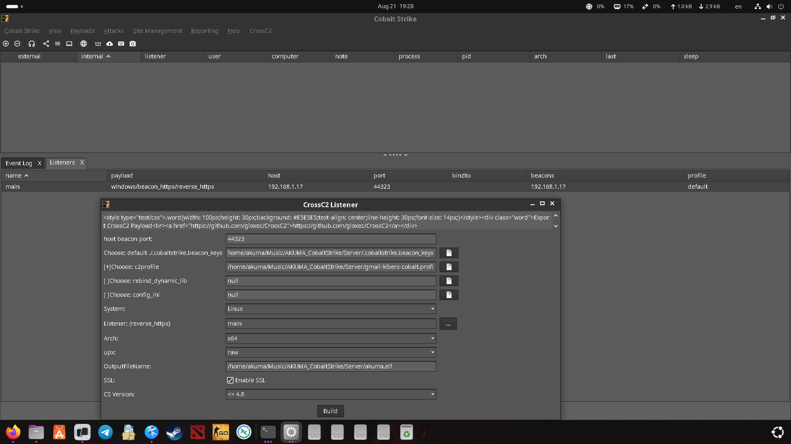
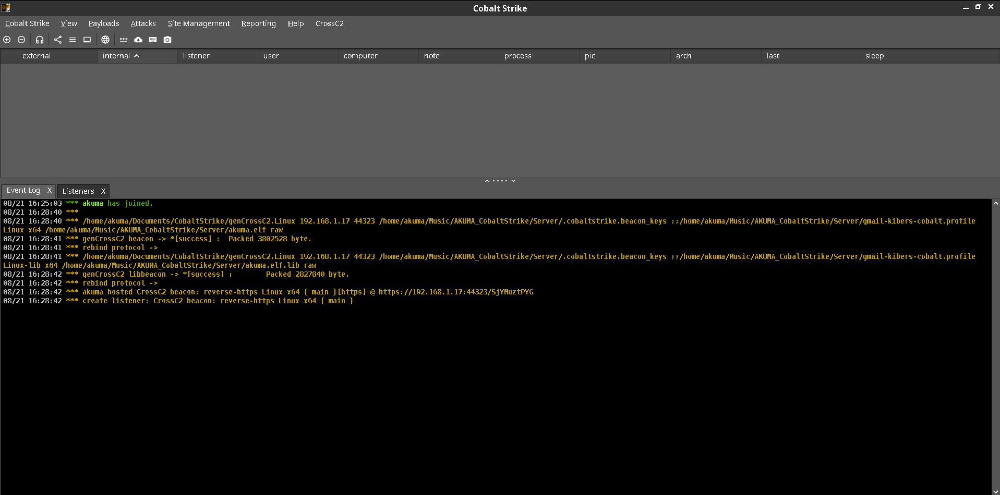
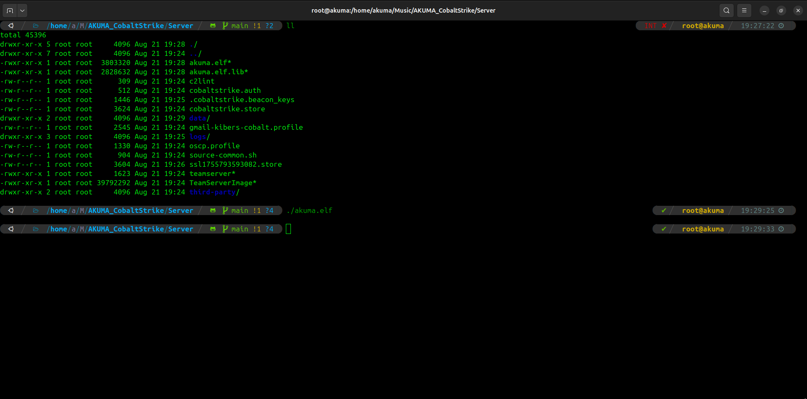
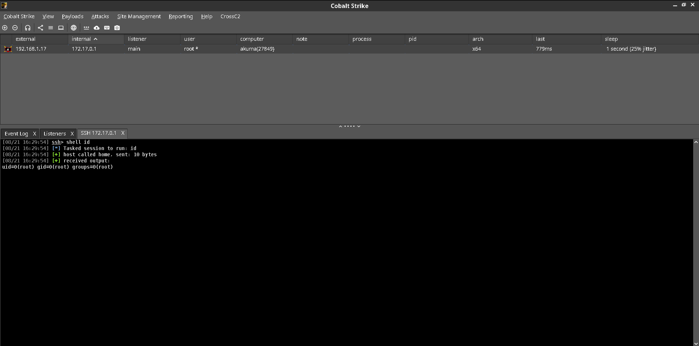

# 🔥 AKUMA CobaltStrike Portable Setup 🔥

**Advanced Penetration Testing Framework with CrossC2 Extensions**

Created by **AKUMA** - legendary hacker & penetration testing guru 😎

---

## 🚀 Quick Start

### 1. Clone & Setup
```bash
git clone https://github.com/sweetpotatohack/AKUMA_CobaltStrike.git
cd AKUMA_CobaltStrike
./setup_portable.sh
```

### 2. Launch TeamServer
```bash
cd Server/
./teamserver 192.168.1.17 theskill19 gmail-kibers-cobalt.profile
```

### 3. Launch Client
```bash
cd Client/
./cobaltstrike-client.sh
```

### 4. Load Extensions
```
Script Manager → Load → ../CrossC2-GithubBot-2023-11-20.cna
Script Manager → Load → ../CrossC2Kit-GithubBot-2023-11-20/CrossC2Kit/CrossC2Kit.cna  
Script Manager → Load → ../CrossC2Kit-GithubBot-2023-11-20/CrossC2Kit/CrossC2Kit_Loader.cna
```

---

## ⚡ Features

### 🔧 Automated Portability
- **Zero configuration** - works out of the box
- **Path auto-detection** - no hardcoded paths
- **Backup system** - automatic backups before changes
- **Cross-platform** - Linux, macOS, Windows support

### 🎯 CrossC2 Integration
- **Multi-platform beacons** - Linux & macOS targets
- **Custom protocols** - steganography & evasion
- **Advanced payloads** - custom communication methods
- **Enhanced features** - extended post-exploitation

### 🛡️ Security Features
- **Malleable C2 profiles** - advanced traffic shaping
- **Operational security** - logs cleanup & detection evasion
- **Encrypted channels** - secure C2 communications
- **Private repository** - code protection

---

## 📁 Project Structure

```
AKUMA_CobaltStrike/
├── 🎯 CrossC2-GithubBot-2023-11-20.cna    # Main CrossC2 script
├── 📁 Server/                             # TeamServer components
├── 📁 Client/                             # GUI client
├── 📁 CrossC2Kit-GithubBot-2023-11-20/    # Extended toolkit
├── 📁 BOF/                                # Beacon Object Files
├── 📁 Recon-AD-master/                    # AD enumeration
├── 🔧 setup_portable.sh                   # Auto-configuration
├── 🛠️ fix_paths.sh                        # Quick path fixer
├── 🔍 check_paths.sh                      # Diagnostics
└── 📖 DEPLOYMENT_GUIDE.md                 # Full instructions
```

---

## 🎪 What's Included

### Core Components
- ✅ **Cobalt Strike 4.x** - Main C2 framework
- ✅ **CrossC2** - Cross-platform extensions
- ✅ **CrossC2Kit** - Enhanced post-exploitation
- ✅ **Custom profiles** - Malleable C2 configurations

### Automation Scripts
- ✅ **Portable setup** - Zero-config deployment
- ✅ **Path management** - Automatic path updates
- ✅ **Health checks** - System diagnostics
- ✅ **Backup system** - Safe configuration changes

### Additional Tools
- ✅ **BOF collection** - Beacon Object Files
- ✅ **AD reconnaissance** - Domain enumeration
- ✅ **Custom payloads** - Evasion techniques
- ✅ **Steganography** - Traffic obfuscation

---

## 🛡️ Security & Disclaimer

### 🔐 Operational Security
- Use **VPN/tunnels** for TeamServer access
- **Rotate infrastructure** between operations
- **Monitor detection** signatures regularly
- **Clean logs** from compromised systems

### ⚖️ Legal Notice
This tool is intended **exclusively** for:
- ✅ **Authorized penetration testing**
- ✅ **Educational purposes**
- ✅ **Security research**
- ✅ **Red team exercises**

**⚠️ WARNING:** Use only with **written permission** from system owners. Unauthorized use is illegal and unethical.

---

## 📸 Visual Confirmation

### ✅ Successful Deployment


**01_successful_connection.png**
- Successful TeamServer connection with active beacon
- Shows connected client (akuma@IP)
- Active beacon visible in interface
- TeamServer running on specified IP

---

### ✅ CrossC2 Scripts Loaded  


**02_crossc2_loaded.png**
- CrossC2 scripts successfully loaded and initialized
- Event Log showing successful script loading
- Messages: `*** akuma has joined.`, `*** genCrossC2 beacon => [Success]`
- Confirmation of path configuration

---

### ✅ CrossC2 Listener Creation


**03_crossc2_listener.png**
- Interface for creating CrossC2 listener for Linux/macOS beacons
- Configuration options: host, port, arch, upx settings
- Profile selection and SSL options
- Ready to generate cross-platform payloads

---

### ✅ CrossC2 Menu Available


**04_crossc2_menu.png**
- CrossC2 menu available in main interface
- Generator submenu accessible
- Confirmation of successful setup and integration
- All CrossC2 functionality ready to use

> 📁 **Screenshots:** Located in [`screenshots/`](screenshots/) directory - See [screenshots/README.md](screenshots/README.md) for details
> 
> 🎆 **Visual Version:** For better image display, see [README_VISUAL.md](README_VISUAL.md) with full-size screenshots
> 
> 💡 **Note:** Screenshots demonstrate successful deployment and confirm all components are working correctly

---

## 🐛 Troubleshooting

### Quick Fixes
```bash
./check_paths.sh       # Diagnose configuration
./setup_portable.sh    # Reset all paths
chmod +x *.sh          # Fix permissions
```

### Common Issues
- **CrossC2 menu missing** → Reload scripts in correct order
- **genCrossC2 not found** → Run `./setup_portable.sh`  
- **Connection failed** → Check firewall & credentials
- **Script errors** → Verify file paths & permissions

---

## 📱 Quick Commands

```bash
# Status check
./check_paths.sh

# After moving project
./setup_portable.sh

# Server (change IP!)
cd Server && ./teamserver YOUR_IP theskill19 gmail-kibers-cobalt.profile

# Client
cd Client && ./cobaltstrike-client.sh
```

---

## 🤘 Credits

**Created by AKUMA** - When you need to pwn everything that breathes! 😈

*"The best penetration tester is one who breaks in first, then explains how to fix it!"*

**Special thanks to:**
- CrossC2 development team
- Cobalt Strike creators  
- Open source security community
- Coffee ☕ (lots of coffee)

---

**Stay sharp, stay stealthy! 🔥**

---

### 📧 Contact
For authorized penetration testing services or security consultations, reach out through secure channels.

**Remember:** *With great power comes great responsibility!* 🕷️
