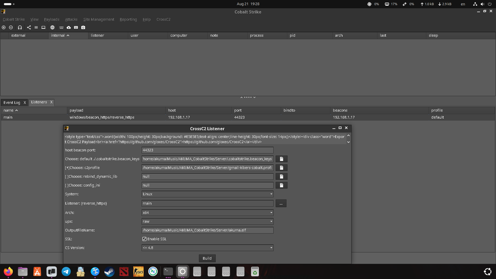
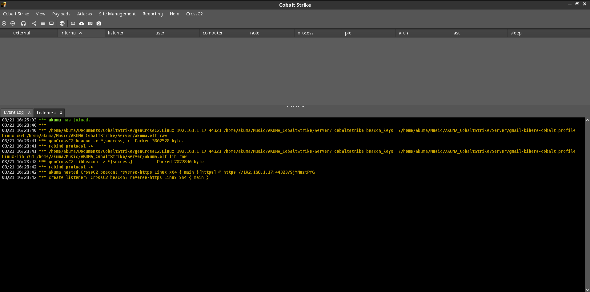
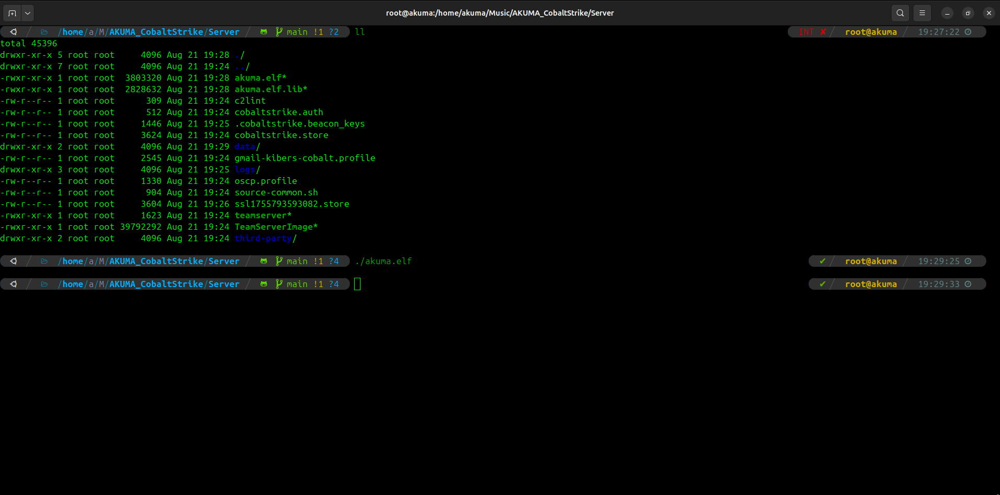
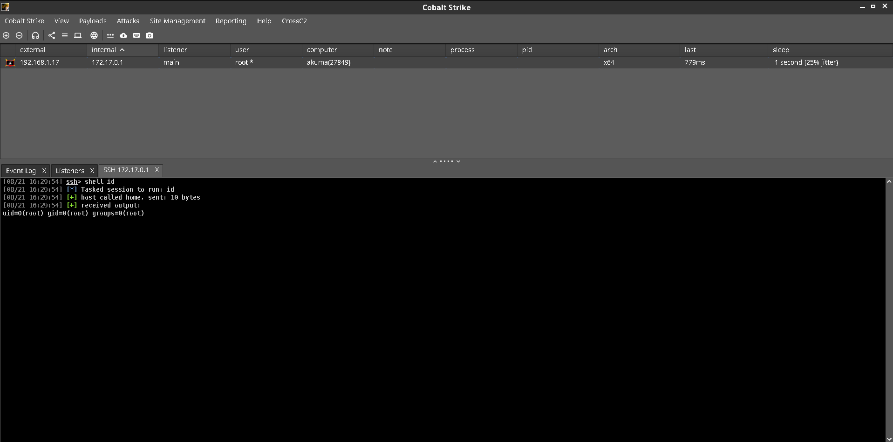

# 📸 AKUMA CobaltStrike - Visual Confirmation

## Screenshots with Direct Image Display

### ✅ Successful Deployment

**Features shown:**
- Successful TeamServer connection with active beacon
- Shows connected client (akuma@IP)
- Active beacon visible in interface
- TeamServer running on specified IP

---

### ✅ CrossC2 Scripts Loaded  

**Features shown:**
- CrossC2 scripts successfully loaded and initialized
- Event Log showing successful script loading
- Messages: `*** akuma has joined.`, `*** genCrossC2 beacon => [Success]`
- Confirmation of path configuration

---

### ✅ CrossC2 Listener Creation

**Features shown:**
- Interface for creating CrossC2 listener for Linux/macOS beacons
- Configuration options: host, port, arch, upx settings
- Profile selection and SSL options
- Ready to generate cross-platform payloads

---

### ✅ CrossC2 Menu Available

**Features shown:**
- CrossC2 menu available in main interface
- Generator submenu accessible
- Confirmation of successful setup and integration
- All CrossC2 functionality ready to use

---

> 💡 **Note:** These screenshots provide visual proof that the AKUMA CobaltStrike setup is working correctly with all CrossC2 components properly integrated.

**Back to main README:** [README.md](README.md)
